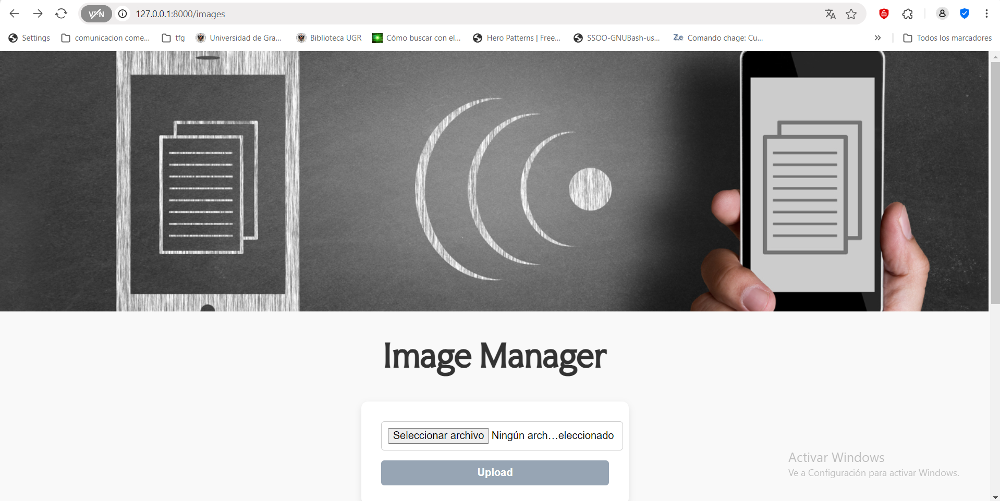
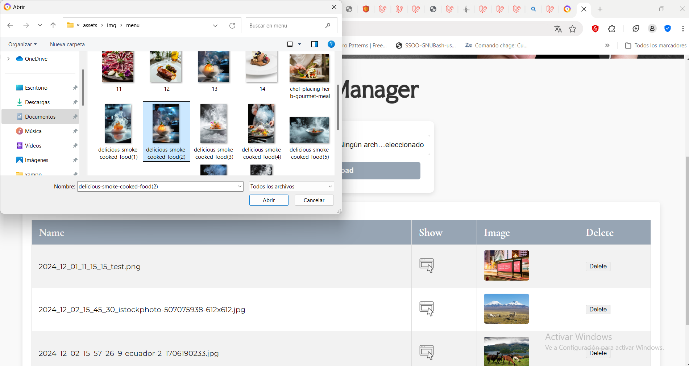
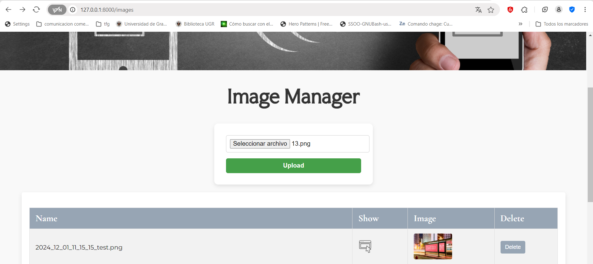
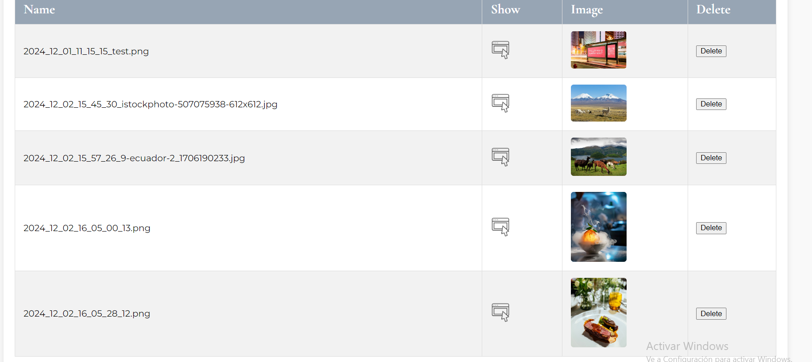
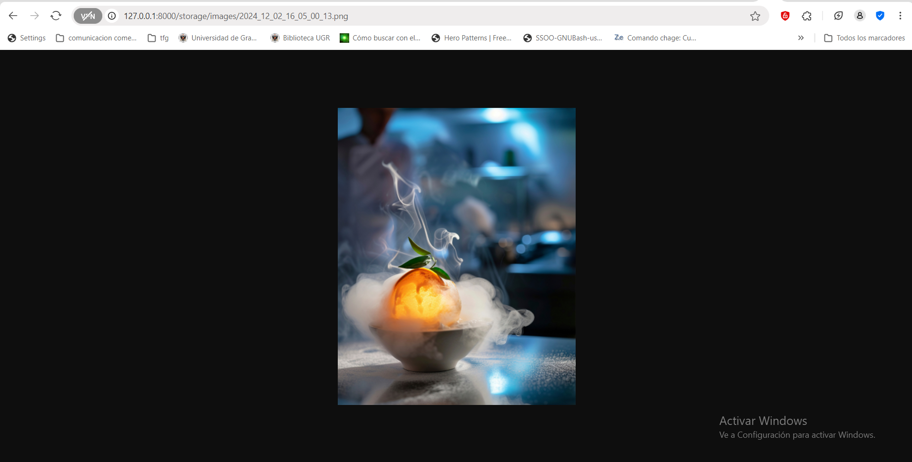
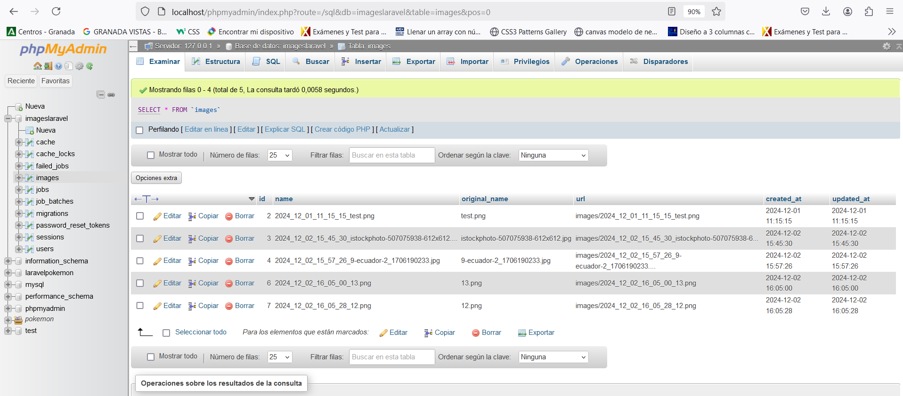

<p align="center"><a href="https://laravel.com" target="_blank"></a></p>

# Upload-Image


---
Este proyecto que hemos desarrollado se trata de un gestor de imágenes utilizando Laravel. Su objetivo es ser funcional y fácil de usar. Permite subir imágenes, almacenarlas, visualizarlas en una tabla organizada y acceder a sus URLs de manera sencilla.
Lo he diseñado pensando en ofrecer una experiencia práctica y eficiente para gestionar imágenes.

---

## **Características del proyecto**

- Subida de imágenes mediante formularios.
- Almacenamiento seguro de imágenes utilizando el sistema de archivos de Laravel.
- Visualización de las imágenes en una tabla.
- Acceso a las URLs de las imágenes.
---

## **Requisitos**

Debemos asegurarnos  de tener instalados los siguientes requisitos antes de ejecutar el proyecto:

- **XAMPP** con PHP >= 8.0 y MySQL.
- Composer.
- Laravel .

---

## **Instalación**

### **1. Configurar el entorno XAMPP**

1. **Inicia XAMPP:**
   - Asegúrate de que **Apache** y **MySQL** estén activados en el panel de control de XAMPP.

2. **Crea una base de datos:**
   - En nuestro caso lo hemos hecho en phpMyAdmin
   - Hemos creado una nueva base de datos para este proyectoen nuestro caso ‘imagesLaravel’

---

2. **Instalación las dependencias de PHP:**

   ```bash
   composer install
   ```

3. **Configuración  del archivo `.env`:**

  Configuramos las credenciales de nuestra base de datos y la URL base:

   ```plaintext
   DB_CONNECTION=mysql
   DB_HOST=127.0.0.1
   DB_PORT=3306
   DB_DATABASE=imagesLaravel
   DB_USERNAME=root
   DB_PASSWORD=     
   ```

5. **Configuramos el almacenamiento público:**

   Creamos un enlace simbólico para que las imágenes subidas sean accesibles públicamente:

   ```bash
   php artisan storage:link
   ```

6. **Ejecutamos las migraciones:**

   ```bash
   php artisan migrate
   ```

---

### **3. Ejecutar el Proyecto en XAMPP**

1. Nuestro proyecto debe estar en el directorio `htdocs` de XAMPP para que se pueda ejecutar.

## **Uso**

1. Abre el proyecto en tu navegador.
2. Accede al formulario de subida de imágenes.
3. Selecciona una imagen desde tu dispositivo.
4. Haz clic en "Upload" para subir la imagen.
5. Visualiza las imágenes subidas en la tabla, con enlaces y previsualizaciones.

---
## **Capturas de Pantalla**

### Subida de Imágenes






### Tabla de Imágenes



### Muestra de Imagen


### Base de Datos



---
